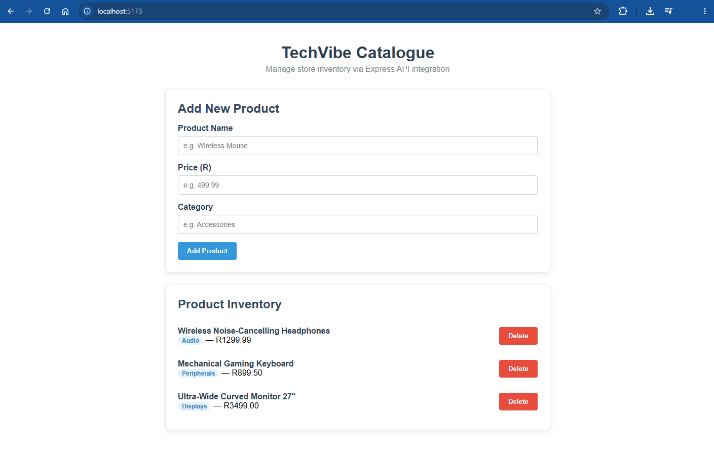

# TechVibe Catalogue - Vue.js & Express API Integration

**Author:** Yusuf Osman  
**Course:** Web Development (Life Choices Academy)  
**Module:** Week 4 - Exercise 02

---

## Overview

TechVibe Catalogue is a full-stack web application featuring a Vue 3 frontend integrated with a Node.js / Express backend API. The application allows users to view, create, and delete store inventory items in real-time.

---

## Application Preview



---

## Key Features

- **Fetch Inventory:** Dynamically loads and displays products from the Express API endpoint (`http://localhost:3000/products`).
- **Add Product:** Reactive Vue form to submit new items (Name, Price, Category) via a `POST` request.
- **Delete Product:** Ability to remove individual items from inventory via a `DELETE` request.
- **Vite Development Server:** Fast frontend development with Hot Module Replacement (HMR).

---

## Tech Stack

- **Frontend:** Vue 3, Vite, JavaScript, HTML5, CSS3
- **Backend:** Node.js, Express.js, Cors, Nodemon

---

## Directory Structure

```text
week4_ex02_vue_api_integration/
├── assets/
│   └── app-preview.png
├── frontend/
│   ├── src/
│   │   ├── App.vue
│   │   └── main.js
│   ├── index.html
│   ├── package.json
│   └── vite.config.js
├── server.js
├── package.json
└── README.md
```
